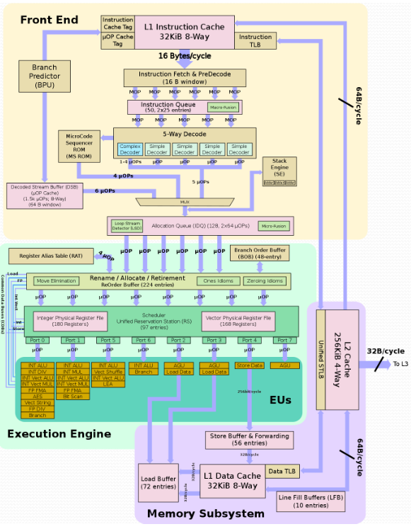
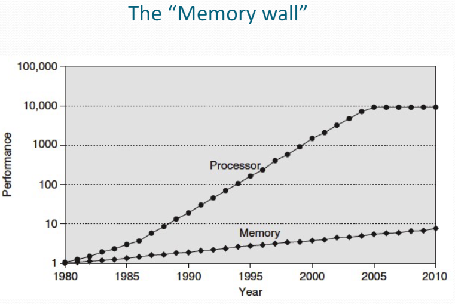
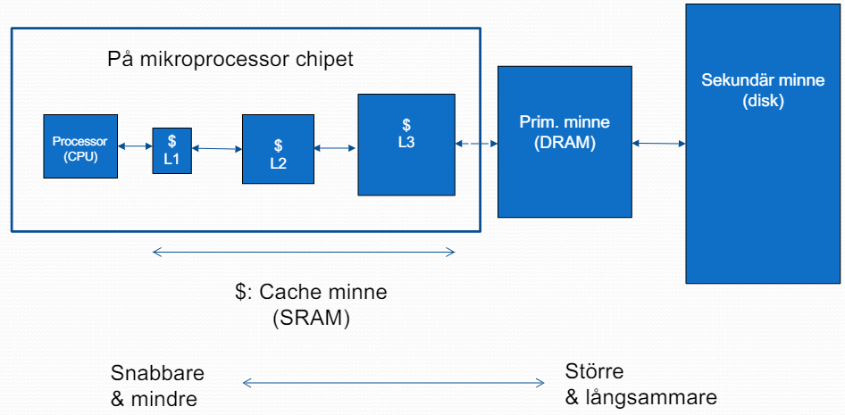
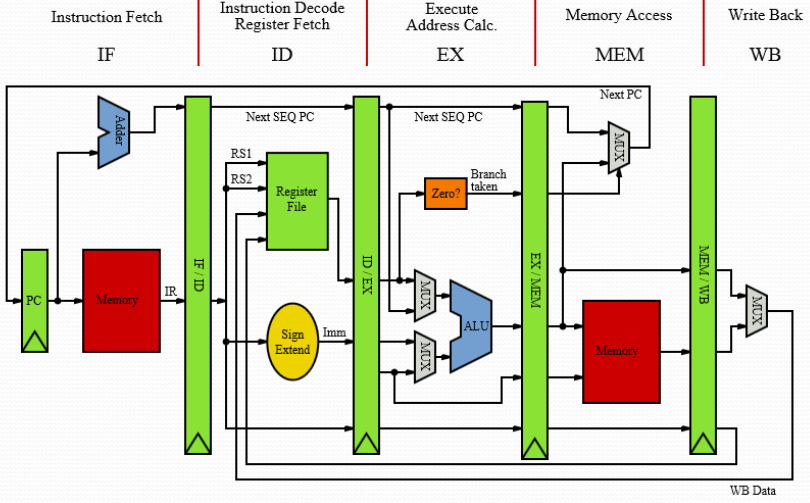

# Lecture 1

Alla föreläsningar finns inspelade på Canvas.

## Kursövergrepp
<!--  -->

### Kursområden:
- Konstruktionsprinciper för
  - Pipelinade mikroprocessorer
  - Minneshierarki: Cache och VM
  - Multiple-issue processorer (Superskalär & VLIW)
  - Flertrådad exekvering
  - Flerkärninga processorer
  - I/O system (skrivminne/SSD)
  - Datoraritmetik hårdvara
- Datorprestanda

### Projektuppgift
Prestandaoptimering av kod och minnessystem för Gauss-elimination

- Algoritm given i C
- Koda i assembly
- Optimera
- Minimera kostnad, exekveringstid
- Betygsätts 3/4/5 (0p/6p/12p)

## Teknologitrender

- Elektronikteknologier utvecklas ständigt
  - Ökad prestanda och kapacitet
  - Minskad kostnad

### Memory Wall

### Minneshierarki

| Typ  | Min delay | Max delay |
| :--- | :-------- | :-------- |
| SRAM | 0.5ns     | 2.5ns     |
| DRAM | 50ns      | 70ns      |
| HDD  | 5ms       | 20ms      |

DRAM använder refreshing när en cell laddar ur.

### MIPS processor

- Mikroprocessorer med flera kärnor
  - Fler än en processor per chip
  - Långsammare klocka -> mindre värme
- Medger fortsatt prestandahöjning
  - Men nu ligger det på mjukvaran att dra nytta av kärnorna/parallella hårdvaran
  - Svårare än "vanlig" sekventiell programmering
    - Last balancering
    - Minimera kommunikation och synkronisering

### Labbar

Labb 1: ASM programmering
Labb 2: Pipelining
Labb 3: Cacheminnen

Deadline för rapport och körningsgodkännande: 18e Maj

## Prestanda

### Mätbarhet

$CPU time = (Instr / Program) * (Clk cycles / Instr) * (Seconds / Clk cycles)$
$CPU time = IC * CPI * T_c$

$IPC = CPI^{-1}$

Prestanda beror av:
- Algoritmen: påverkar IC, möjligtvis CPI
- Språk: påverkar IC, CPI
- Kompilatorn: påverkar IC, CPI
- ISA: påverkar IC, CPI, $T_c$

$$
\sqrt[n]{\prod_{i=1}^{n} ETR_i}
$$
ETR = Execution time ratio

## MIPS arkitektur

RISC (Reduced Instruction Set Computers)
- "Enklare" instruktioner & adresseringssätt
- Gör processorerna mindre komplexa -> snabbare
  
CISC (Complex Instruction Set Computers)
- Komplexa instruktioner & adresseringssätt

De flesta moderna processorerna är av RISC-typ
- Intel x86 är CISC externt / RISC internt

### Register
MIPS har en 32 x 32-bit register file (RF)
- Numrerad 0 - 31

Assembler registernamn
- t0, t1, ..., t9 för temporära värden
- s0, s1, ..., s7 för sparade variabler 

### Minnesoperander
- För att utföra operationer på data i M:
  - *Load* (lw) värden från M in till register i RF
  - Utför aritmetisk instruktion
  - *Store* (sw) resultat från register till M
- Minnet i MIPS är byte addresserat
  - Varje adress identifierar en byte
- Ett ord är 4 bytes
- MIPS använder Big Endian lagring i minnet
  - Mest signifikant byte ligger på den lägsta adressen i ordet

### Immediate operander
Appendar "i" till instruktionsnamnet

    addi $s3, $s3, 4
    addi $s2, $s1, -1

>Make the common case fast

### Konstanten noll
MIPS har ett register zero och innehåller alltid värdet 0
- Kan inte skrivas över
Användbar för vanliga operationer
- T.ex., flytta mellan register