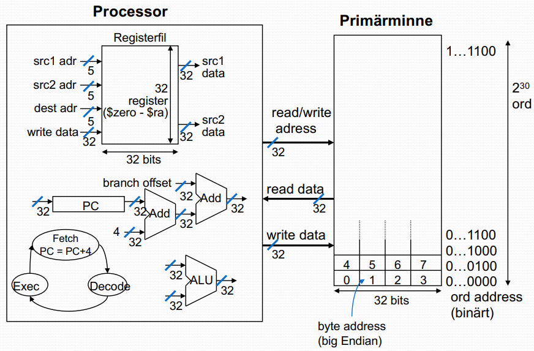
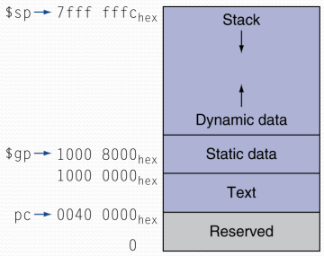
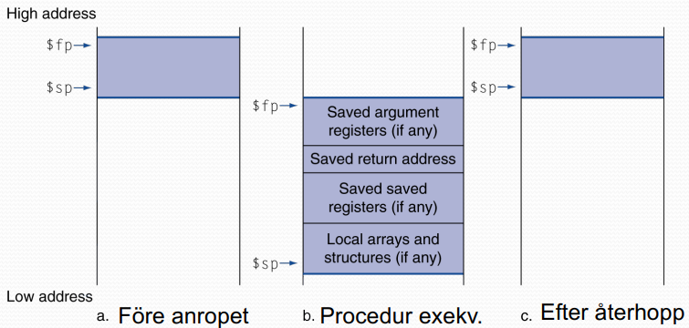
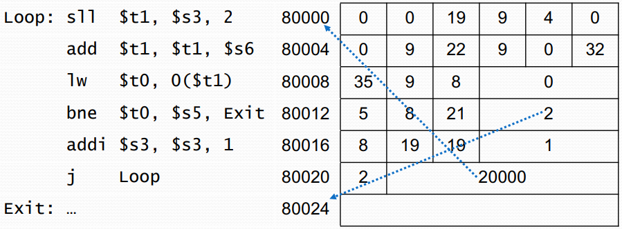

# Lecture 2

Basic layout of the MIPS processor

### Funktionsanrop i MIPS
C-kod: &lt;resultattyp&gt; funknamn (parametrar)

    int exempel (int g, h, i, j) {
        int f;
        f = (g + h) - (i + j);
        return f;
    }

Delsteg:
1. Placera inparametrarna i registerfilen
2. Anropa funktionen
3. Allokera plats för ev. sparade och lokala variabler
4. Exekvera funktionen
5. Placera resultat i register
6. Återställ ev. stacken
7. Returnera till anropande kod

**Registeranvändning**
- \$a0 - \$a3: inparametrar (reg 4-7)
- \$v0, \$v1: resultatvärden (reg 2 och 4)
- \$t0 - \$t9: temporära variabler
  - Kan förändras av anropad procedur
- \$s0 - \$s7: "sparade" register
  - Måste **sparas och återställas** av anropad procedur
- \$gp: "global pointer" för statisk data (reg 28)
- \$sp: "stack pointer" (reg 29)
- \$fp: "frame pointer" (reg 30)
- \$ra_ "return address" (reg 31)

**Proceduranrop**
Procedur anrop: "jump and link"

    jal Label

- Adressen till efterföljande instruktion placeras i register \$ra
- Hoppa till proceduren
  
Återhopp: "jump register"

    jr $ra

- Kopierar \$ra till programräknaren (PC)
- Kan även användas för case/switch satser

**Exempel**
C-kod:

    int exempel (int g, h, i, j) {
        int f;
        f = (g + h) - (i + j);
        return f;
    }

- Argument g-j finns i \$a0 - \$a3
- f lagras i \$s0 (s-register, vi måste spara \$s0 på stacken!)
- resultat i \$v0

MIPS-kod:

    exempel:
        addi    $sp, $sp, -4
        sw      $s0, 0($sp)     # Spara $s0 på stacken
        add     $t0, $a0, $a1
        add     $t1, $a2, $a3
        sub     $s0, $t0, $t1   # procedur kod
        add     $v0, $s0, $zero # resultat
        lw      $s0, 0($sp)
        addi    $sp, $sp, 4     # återställ $s0
        jr      $ra             # return

**Procedurer som anropar andra procedurer**

Anropande procedur måste spara på stacken:
- Sin egna återhoppsadress
- Alla argument och temporära variabler som behövs efter anropet

Återställ stacken efter anropet

**Fackultet exempel**
C-kod:

    int fact (int n) {
        if (n < 1) return 1;
        else return n * fact(n-1);
    }

- Argument n i \$a0
- Resultat i \$v0

MIPS-kod:

    fact:
        addi    $sp, $sp, -8    # adjust stack for 2 items
        sw      $ra, 4($sp)     # save return address
        sw      $a0, 0($sp)     # save argument
        slti    $t0, $a0, 1     # test for n < 1
        beq     $t0, $zero, L1
        addi    $v0, $zero, 1   # if so, result is 1
        addi    $sp, $sp, 8     # pop 2 items from stack
        jr      $ra             # and return
    L1: addi    $a0, $a0, -1    # else decrement n
        jal     fact            # recursive call
        lw      $a0, 0($sp)     # restore original n
        lw      $ra, 4($sp)     #   and return address
        addi    $sp, $sp, 8     # pop 2 items from stack
        mul     $v0, $a0, $v0   # multiply to get result
        jr      $ra             # and return

**Vad finns i minnet (MIPS)**
- **Text**: program kod
- **Static data**: globala variabler
  - T.ex. statiska variabler i C, konstanta arrays och strings
  - \$gp använder med $\pm$offset för access inom detta segment
- **Heap**: dynamisk data
  - T.ex. "malloc" i C, "new" i Java
- **Stack**: Argument och lokala variabler

**Lokala data på stacken**

- Plats för lokala data allokeras av anropad procedur
  - T.ex. C "automatic variables"
- Procedure frame ("activation record")
  - Används av vissa kompilatorer för stackhantering

**Operationer på mindre operander**
Mindre operander: byte/halfword

MIPS byte/halfword load/store
- Används t.ex. vid strängbearbetningar

`lb rt, offset(rs) / lh rt, offset(rs)`
- Tecken utvidgning till 32 bits görs i hårdvaran

`lbu rt, offset(rs) / lhu rt, offset(rs)`
- '0'-utfyllning till 32 bits görs i hårdvaran
- typ unsigned

`sb  rt, offset(rs) / sh rt, offset(rs)`
- Spara del av ord (MSB)

**Strängkopiering**
C-kod:

    void strcpy (char x[], char y[]) {
        int i;
        i = 0;
        while ((x[i] = y[i]) != '\0')
            i += 1;
    }

MIPS-kod:

    strcpy:
        addi    $sp, $sp, -4        # adjust stack for 1 item
        sw      $s0, 0($sp)         # save $s0
        add     $s0, $zero, $zero   # i = 0
    L1: add     $t1, $s0, $a1       # addr of y[i] in $t1
        lbu     $t2, 0($t1)         # $t2 = y[i]
        add     $t3, $s0, $a0       # addr of y[i] in $t1
        sb      $t2, 0($t3)         # x[i] = y[i]
        beq     $t2, $zero, L2      # exit loop if y[i] == 0
        addi    $s0, $s0, 1         # i = i + 1
        j       L1                  # next iteration of loop
    L2: lw      $s0, 0($sp)         # restore saved $s0
        addi    $sp, $sp, 4         # adjust stack pointer
        jr      $ra                 # and return

**Hantering av stora konstanter**
- Många konstanter är små
  - 16-bitars immediate är ofta tillräckligt
- Men, om fler än 16 bitar krävs: `lui rt, konstant`
  - Kopierar "konstant" till de 16 mest signifikanta bitpositionerna i rt
  - Samt nollställer de 16 minst signifikanta bitpositionerna i rt
  - Kombineras med en ori-instruktion

`lui $s0, 125`:
**0000 0000 0111 1101** 0000 0000 0000 0000
`ori $s0, $s0, 2304`: 
0000 0000 0111 1101 **0000 1001 0000 0000**

**Hopp adressering (beq, bne)**
- Hoppinstruktioner specificerar:
  - Opkod, 2 register, branch offset
- De flesta hopp i datorprogram är "nära" hopp
  - Framåt eller bakåt
  - J-format:
    - op: 6 bits
    - rs: 5 bits
    - rt: 5 bits
    - bo: 16 bits (branch offset)

PC-relativ adressering:
- PC pekar först på efterföljande instruktion (PC += 4)
- Target address = PC + offset * 4

**Längre hopp**
Hopp adress (**j** och **jal**) kan vara någonstans inom "text" segmentet.
- (del av) hoppadressen kodas in i instruktionen (26 bits)

Format:
- op = 6 bits
- adress = 26 bits

Resterande 6 bitar tas från nuvarande PC
Target adress = $PC_{31..28}$: address * 4
"Pseudo direct jump addressing"

Loopkod xempel:
- Antag att Loop startar på $80000_{10}$

