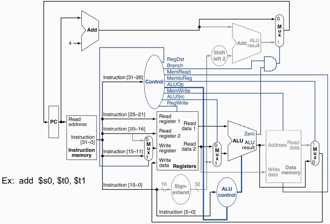

# Lecture 3

## Datavägens byggblock

### Introduktion
CPU prestanda: $T_{exe}=IC*CPI*T_C$

För en given ISA
- **IC** (**I**nstruction **C**ount)
  - Avgörs av algoritmen, programspråket, kompilatorn och ISAn
- **CPI** (**C**lockcycles **P**er **I**nstruction)
  - Avgörs av kompilatorn och implementationen av ISAn (i hårdvara)
- $T_c$ (klockcykeltiden)
  - Avgörs av implementationen av ISAn (i hårdvara)

Presentation av två MIPS implementationer:
- En förenklad version
- En (representativ och realistisk) pipelinad version

### Instruktionsexekvering
1. **Hämta** instruction. PC $\to$ instruktionsminnet
2. **Avkoda** instruktionen och läs från register
3. Exekvera instruktionen
    - Aritmetisk/logisk beräkning
    - Beräkning av effektiv minnesadress
    - Beräkning av hoppadress/villkor
4. **Läs/skriv från/till dataminnet** för load/store instruktioner
5. **Skriv tillbaka** resultat i registerbanken (RF)

### Styrlogik

### Logikkonstruktion (grunder)
Information kodas binärt
- *Låg* spänning = 0, *Hög* spänning = 1
- En tråd (signalledare) per bit
- Multi-bit data på flertrådiga **bussar**

Kombinatoriska element
- Opererar på data
- Output är en funktion av input

Tillståndselement
- Lagrar information

### Tillståndselement
Register: lagrar data
- Använder en klocksignal för att uppdatera det lagrade värdet
- **Flanktriggat register:** uppdatera då **CLK** ändras

Register med *write control*
- För villkorlig uppdatering
- Uppdatering sker endast då styrsignalen *write* = 1

### Klockning
Kombinatoriska logik transformerar data under en klockcykel
- Mellan klockflanker
- Input från register, output till register
- Den längsta fördröjningen genom det kombinatoriska blocket bestämmer klockperioden 

### En första implementation
Dataväg/Datapath
- Kretsar som processerar data och adresser i en CPU
  - Byggelement: Minnesstrukturer (registerbank), ALUer, bussar, multiplexar
- Vi bygger nu en dataväg i MIPS steg-för-steg utgående från en grov instruktion

Indata $\to$ Dataväg $\to$ Utdata

### Instruction Fetch (IF)

### R-format instruktioner
- Läs två registeroperander
- Utför aritmetisk/logisk operation
- Skriv resultatvärdet till registerfilen

5 bitars bredd: MSB för read/write control och 4 LSBs för registernummer (?)

### Load/store instruktioner

`lw $destreg, offs($basreg)` eller `sw $källreg, offs($basreg)`
- Läs registeroperander
- Beräkna adressen m.h.a. 16-bit offset. Använd ALUn, men **teckenutvidga** offset

`lw`: Läs från dataminnet och uppdatera register
`sw`: Skriv registervärde till dataminnet

`offs` är en 16 bitars bredd konstant

### Hoppinstruktioner (villkorliga)
`beq/bne    $reg1, $reg2, Label`
- Läs registeroperander
- Jämför operander
  - Använd ALUn ("zero" output)
- Beräkna hoppadressen
  - Teckenutvidga "displacement"
  - Skifta vänster 2 bitpositioner (word displacement)
  - Addera detta till PC
    - OBS! PC+4 är redan utfört av fetch-logiken

`beq, bne`:

## Sätt samman blocken (ej-pipelinad)
**Först: Icke-pipelinad dataväg**. Utför en komplett instruktion per klockcykel

### Dataväg (ej pipelinad)

### Styrlogik för datavägen

**Dataväg med styrlogik**

**R-typ instruktioner**

**Load instruktionen**

**Branch-on-Equal instruktionen** (`beq`)

**Jumps**

- Jumps använder ord-adress
- Uppdatera PC med konkatenering av:
  - Högsta 4 bitarna av nuvarande PC (PC+4)
  - 26-bitars hoppadress
  - 00 inskiftas från höger
- Kräver en extra styrsignal vilken avkodas från opkoden

**Dataväg med Jumps**

### Prestanda

Den längsta signalfördröjningen avgör klockperioden
- "Kritiska vägen" (critical path Digides) fås vid load instruktionen:
  - Instruktionsminnet $\to$ registerfilen $\to$ ALU $\to$ dataminnet (DM) $\to$ registerfilen

## Sätt samman blocken (pipelinad)

### MIPS pipeline
1. **IF:** **I**nstruction **F**etch från minne
2. **ID:** **I**nstruction **D**ecode & register read
3. **EX:** **Ex**ecute operation eller beräkna adress till DM
4. **MEM:** Accessa DM
5. **WB:** **W**rite **B**ack, resultat till registerfilen

Se slide 29-34 för mer detalj

### Pipeline prestanda
Antag att signalfördröjningen är:
- 100 ps för registerfilen (läs eller skriv)
- 200 ps för andra steg

Jämför nu den pipelinade datavägen med icke-pipelinad
| Instr    | Instr fetch | Register R | ALU op | Memory access | Register W | Total |
| :------- | :---------- | :--------- | :----- | :------------ | :--------- | :---- |
| lw       | 200ps       | 100ps      | 200ps  | 200ps         | 100ps      | 800ps |
| sw       | 200ps       | 100ps      | 200ps  | 200ps         |            | 700ps |
| R-format | 200ps       | 100ps      | 200ps  |               | 100ps      | 600ps |
| beq      | 200ps       | 100ps      | 200ps  |               |            | 500ps |

### Pipeline speedup
Om alla pipe-steg är "balanserade" (alla steg tar lika lång tid)

$$
Speedup = \frac{T_{c, icke pipelinad}}{T_{c, pipelinad}}\approx Antal\ pipesteg
$$

Om pipelinen är obalanserad så är Speedup mindre
Speedup pga **ökad genomströmning**
- Latenstiden (tid för enskild instruktion) påverkas däremot inte! 

### Konflikter (hazards) i datavägen
Situationer som förhindrar start av en instruktion i nästa klockcykel:
- **Strukturell konflikt** (*structural hazard*)
  - Ett block är upptaget med annan operation
- **Data**konflikt (*data hazard*)
  - Beroende av föregående instruktion
- **Styr**konflikt (*control hazard*)
  - Hoppvillkor och hoppadress är inte utvärderad vid instruktionsuthämtning

### Strukturell hazard
- Flera instruktioner vill använda en enhet samtidigt
  - Ex 1: Registerfilen: läsa och skriva till samma register
    - En lösning: skriv och läs i separata halvperioder
  - Ex 2: I pipelines som endast har ett minne
    - Load/store kräver dataminnes access
    - Intruktionsuthämtning skulle behöva stoppas (stall) vid	sådan konflikt
    -  Därför, pipelinad dataväg använder oftast **separata	
instruktions och data minnen**

### Data hazards
En instruktion behöver data som produceras av en tidigare instruktion (vilken ännu ej är klar)

### Forwarding (aka bypassing)
Använder resultatet direkt då det är beräknat i ALU
- Vänta inte tills det lagrats i registerfilen
- Kräver extra signalledningar och mux i datavägen
- Ingen stall av pipen behövs i detta fall

