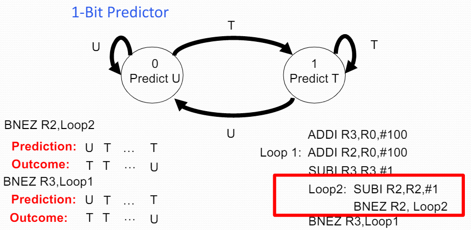
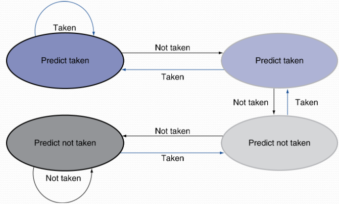

# Lecture 4

## Styrning av pipelinen
5-stegs MIPS Pipeline:
IF $\to$ ID $\to$ EX $\to$ MEM $\to$ WB

För varje steg i pipelinen förs alla tillståndselement med tillsammans med instruktionen.

### Hantering av hazards och forwarding
RAW: **R**ead **A**fter **W**rite

**Databeroenden**: Kan leda till RAW hazards beroende på hur pipelinen ser ut.

Vi kan använda *forwarding* som lösning genom att detektera när detta behöver ske.
- Låt registernummer följa med i pipelinen
- ALU operand registernummer i EX steget ges av:
  - ID/EX.RegisterRs, ID/EX.RegisterRt
- Data hazards då:
    1a. EX/MEM.RegisterRd = ID/EX.RegisterRs
    1b. EX/MEM.RegisterRd = ID/EX.RegisterRt
    2a. MEM/WB.RegisterRd = ID/EX.RegisterRs
    2b. MEM/WB.RegisterRd = ID/EX.RegisterRt
- Men, endast om intruktionen kommer att skriva till ett register
  - EX/MEM.RegWrite, MEM/WB.RegWrite
- Och, endast om Rd för instruktionen inte är `$zero`
  - EX/MEM.RegisterRd $\not=$ 0
  - MEM/WB.RegisterRd $\not=$ 0

### Forwarding logiska villkor
EX hazard:
`if (EX/MEM.RegWrite and (EX/MEM.RegisterRd != 0)) and (EX/MEM.RegWrite = ID/EX.RegisterRs) => ForwardA = 10`

`if (EX/MEM.RegWrite and (EX/MEM.RegisterRd != 0)) and (EX/MEM.RegWrite = ID/EX.RegisterRt) => ForwardB = 10`

MEM hazard:
`if (MEM/WB.RegWrite and (MEM/WB.RegisterRd != 0)) and (MEM/WB.RegWrite = ID/EX.RegisterRs) => ForwardA = 01`

`if (MEM/WB.RegWrite and (MEM/WB.RegisterRd != 0)) and (MEM/WB.RegWrite = ID/EX.RegisterRt) => ForwardB = 01`

### Dubbel datahazard

    add $1, $1, $2  # A := A+B
    add $1, $1, $3  # D := A+C
    add $1, $1, $4  # F := D+E

Databeroenden:
$
\begin{bmatrix}
    add & 1 & 0 & 0 \\
    add & 2 & 1 & 0 \\
    add & 0 & 2 & 0
\end{bmatrix}
$

Båda hazarderna inträffar
- Vi vill använda det senaste resultatet
Revidera villkoret för hazard i MEM:
- Endast fwd från MEM om ingen EX hazard

### Hur löser hårdvara "load-use" hazarder?

Load-Use hazard detektion
- Checka då den *använda* instruktionen finns i ID steget
- ALU operandregisternummer i ID steget ges av:
  - IF/ID.RegisterRs, IF/ID.RegisterRt
- Load-use hazard då:
  - ID/EX.MemRead and ((ID/EX.RegisterRt = IF/ID.RegisterRs) or (ID/EX.RegisterRt = IF/ID.RegisterRt))
  - Om sant, stalla pipelinen.

### Hur stallar man pipelinen?
- Sätt bitarna i ID/EX-registret till 0: `NOP` i EX steget
- Stoppa uppdateringen av PC (och IF/ID registret)
  - Efterföljande instruktion **hämtas igen**
  - Den *använda* instruktionen **avkodas igen**

**Stall/bubbla i pipelinen**

### Hur löser hårdvaran hazarder vid hopp?
Hoppkonflikter:
- Kom ihåg: villkorliga hoppinstruktioner utvärderas i EX steget
- Det tar tre cykler för en hoppinstruktion att bestämma var nästa instruktion ska hämtas
- Prestandaförlust: 3 cykler för varje hoppinstruktion

Hoppstrategi: "Fördröjda hopp"
- Kör **alltid** instruktionen efter hoppinstruktionen (**delay slot**)
- Fyll denna slot med en *nyttig* instruktion (om möjligt, annars `NOP`)
- Enkel metod för att lösa styrhazarden

Exempel:

    # antag att vektorn ligger mellan adress 1 och 1000
    # källvektorn pekas ut med $2
    # destinationsvektorn pekas ut med $3

    Loop:   lw      $1, 0($2)
            sw      $1, 0($3)
            addi    $2, $2, -4
            addi    $3, $3, -4
            bne     $2, $zero, Loop (stall cykel)

    NyLoop: lw      $1, 0($2)
            addi    $2, $2, -4
            addi    $3, $3, -4
            bne     $2, $zero, NyLoop
            sw      $1, 4($3) # delay slot

### Exceptions/interrupts
Exception :: "Oväntad händelse"
- Exception
  - Internt i processorn
    - t.ex. ogiltig opcode, overflow, syscall
- Interrupt
  - Externt, från en I/O controller t.ex.

**Hantering av exceptions**
- I MIPS hanteras exceptions av en *System Control Coprocessor* (CPo)
- Behöver spara PC:
  - I MIPS: *Exception Program Counter* (EPC)
- Spara information om anledning till avbrottet
  - I MIPS: *Cause* registret
- Hoppa till avbrottsrutin

**Exceptions i en pipeline**
- En annan form av styrkonflikt
- Antag t.ex. overflow i EX-steget: `add $s1, $s2, $s1`
  - Se till att register \$s1 inte uppdateras
  - Kör klart föregående instruktioner
  - Flusha `add` och efterföljande instruktioner
  - Set Cause och EPC register
  - Hoppa till avbrottsrutin

## Avancerade metoder för prestanda-optimering

### Dynamisk hopp-predikation
I djupare pipelines är prestandaförluster vid hopp större

Använd dynamisk "run-time" hopp-predikation
- *Branch prediction buffer* (aka *branch history table*)
- Indexerad via adresser till hoppinstruktionerna
- Tabellen lagrar utfallen (branch taken/not taken)
- Vid hopp
  - Läs tabell
  - Hämta nästa instruktion enligt hopp-prediktionen
  - Om fel, flusha pipen och uppdatera prediktionen

En bits prediktor:

Example:
*Question:*
Consider the following history for the outcome of a branch where 1=taken and 0=untaken: `01111101011110`
Determine the branch prediction accuracy for a 1-bit preditor assuming it is initially in state=0.

*Answer:*
Prediction: `00111110101111`
Outcome: `01111101011110`
Correct predictions: $8$
Number of outcomes: $14$
Prediction accuracy: $\frac{8}{14}=57\%$

Inte så bra: hoppet i den inre loopen miss-predikteras 2 gånger per *outerloop* iteration.

Två bitars prediktor:
Inverterar endast prediktionen vid 2 successiva missprediktioner. Bättre än 1-bitars prediktorn

**Beräkning av hopp-adressen**
*Branch Target Buffer* (BTB) är en lösning för att tidigarelägga beräkningen av hoppadress
  - Ett slags *Cache* för hoppadresser
  - Indexerat med PC vid IF
    - Om "hit" i BTB och hopp-prediktion förutsäger att hopp skall ske så kan hopp-adressen tas direkt ur BTBn!

### Instruction-Level Parallelism (ILP)
- Pipelining: exekverar flera instruktioner parallellt via överlappning
- För att öka ILP:
  - Djupare pipelines:
    - Mindre arbete per steg $\implies$ kortare klockcykel
    - Men fler hazarder!
  - *Multiple issue CPU*
    - Kan starta upp flera instruktioner per klockcykel
    - Flera pipelines (Functional Units, FUs)
    - Då kan $CPI < 1$, så vi använder istället *Instructions Per Cycle* ($IPC=\frac{1}{CPI}$)
    - T.ex., 4 GHz 4-way Multiple issue
      - 16 BIPS, max IPC = 4 (idealt)
      - Men Hazards minskar detta i praktiken dock

### VLIW och superskalära processorer
**Statisk** multiple issue (VLIW)
- **Kompilatorn** grupperar ihop instruktioner som startas samtidigt
- Packeterar dem i *issue slots*
- Kompilatorn detekterar och hanterar hazarder vid *compile-time*

**Dynamisk** multiple issue (Superskalär)
- **CPU** hårdvaran undersöker instruktionsströmmen och väljer ut vilka som skall startas i en viss klockcykel
- Kompilatorn kan hjälpa till genom omflyttning av kod
- Processorn hanterar hazarderna vid *run-time*

### Spekulativ exekvering

*Gissa* vad en instruktion vill göra
  - Starta operationen så snart som möjligt
  - Kontrollera sedan om gissningen var korrekt
    - Om så, bra! Avsluta op
    - Annars, backa tillbaka

Vanligt förekommande vid statisk och dynamisk multiple issue
Exempel:
  - Spekulera vid hopp
    - Backa tillbaks om fel väg tagits
  - Spekulera vid load
    - Återställ vid felspekulering och om något register eller minne uppdaterats

### MIPS med statisk dual issue
VLIW = Very Long Instruction Word processor

Exempel: paket med 2 instruktioner:
- En ALU/branch op
- En Load/store op
- 64 bits paket
  - NOP om plats inte kan fyllas

Schemaläggd kod för DI MIPS

    Loop:
        lw $t0, 0($s1)              # $t0=array element
        addu    $t0, $t0, $s2       # addera $s2
        sw      $t0, 0($s1)         # skriv resultat
        addi    $s1, $s1,–4         # dekrementera
        bne     $s1, $zero, Loop    # hoppa om $s1!=0

| Label | ALU/hopp               | Load/store       | Cykel |
| :---- | :--------------------- | :--------------- | :---- |
| Loop: | nop                    | `lw $t0, 0($s1)` | 1     |
| -     | `addi $s1, $s1, -4`    | nop              | 2     |
| -     | `addu $t0, $t0, $s2`   | nop              | 3     |
| -     | `bne $s1, $zero, Loop` | `sw $t0, 4($s1)  | 4     |

$$
    IPC = \frac{5}{4} = 1.25 (jmfr.\ max\ IPC=2)
$$

### Loop unrolling
Replikera loopkoden för att exponera mer parallellism
- Minskar också loop-control overhead
Använd olika register per replikation
- Benämnt *register renaming*
- Hanterar namn- och antiberoenden
  - Write after Read till samma register (WAR hazard)
  - Write after Write till samma register (WAW hazard)