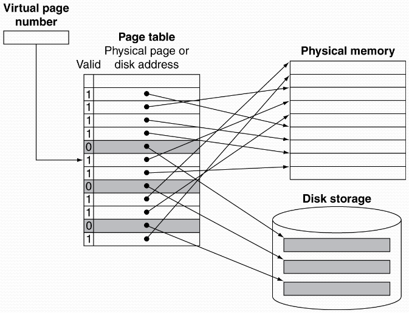

# Lecture 6 - Virtuellt Minne

**Varför är VM viktigt?**
- Större adresserbart utrymme än vad primär-minnet erbjuder
- Skydd vid processers minnesacesser (kontroll av rättigheter R,W,P)
- Portabilitet av programvara

**Vad är VM?**
- CPU har både en virtuell och en fysisk adressrymd
- CPU använder virtuella adresser (VA) vid minnesacesser
- Hårdvaran översätter VA $\to$ FA (fysisk adress) före minnesacesser

**Virtuellt Minne**
- VM använder PM som ett slags "cache"
- Styrs gemensamt av operativsystemet och CPU hårdvaran
- Programmera delar på PM
  - Varje program/process har ett eget virtuellt adressrum
  - Skyddat från andra program/processer
- CPU översätter VA till FA
  - VM "block" kallas för en **sida** (RAM page)
  - VM översättningsmiss kallas för **sidfel** (page fault)

## Adressöversättning

- Vid sidfel måste sidan hämtas in från sekundärminnet (SM)
  - Kan ta miljoner klockcykler
  - Hanteras av OS kod

- Viktigt med låg miss rate i VM
  - Sidor placeras med full associativitet i PM
  - Bra algoritmer för vilken sida som skall bytas ut

## Sidtabeller
- En sidtabell innehåller placeringsinformation
  - Sidtabell: Tabell i PM, indexerad med det "virtuella sidnumret"
  - Ett register (Page Table Register) i CPUn pekar till tabellens start i PM
- Om sidan finns inne i PM
  - Sidtabellen ger det "fysiska sidnumret"
  - Plus några andra status bitar (Referenced, Dirty, ...)
- Om sidan *inte* finns inne
  - Sidtabellen pekar på en sekundärminnesplats

**Adressöversättning med en sidtabell**

**Mappa sidor till PM eller disk**

**Utbyten av sidor och skrivningar**
- Ofta används en approximativ Least-Recently Used (LRU) algoritm
  - **"Reference" bit** (aka "use bit") sätts till 1 vid access till sidan
  - Nollställs av Os (efter regelbundna intervall)
- Diskskrivningar tar miljoner klockcykler
  - "Write through" opraktisk
  - Använd "Write back"
  - **"Dirty bit"** som sätts till 1 vid skrivning av sidan

**Snabb översättning med TLB**
TLB: Translation Look-aside Buffer

- Kräver adressöversättningen dubbla minnesreferenser?
  - En för att accessa sidtabellen
  - Och sedan en för den verkliga minnesaccessen
- Nej, oftast inte. Accesser till sidtabllen uppvisar god lokalitet
  - Så vi kan använda en snabb **cache** i CPUn som innehåller de senaste mest aktuella översättningarna
  - T.ex.: 16–512 PTE (Page Table Entry), 0.5–1 cycle för en hit, 10– 100 cykler för miss, 0.01%–1% miss rate
  - Missar i TLB kan hanteras av HW eller av SW

**TLB missar**
- Om sidan finns inne i PM
  - Läs in översättningen till TLBn och försök igen
  - Kan göras i HW
    - Kan bli svårt vid komplexa sidtabellstrukturer
  - Eller i mjukvara
    - Exception $\to$ En optimerad avbrottsrutin sköter jobbet
- Om inte (aka page fault)
  - OS hanterar hämtningen av sidan från SM och uppdateringen av sidtabellen
  - Läs in översättningen till TLBn
  - Återstarta instruktionen som skapade sidfelet

**Page fault rutin**
1. Lokalisera sidan i SM
2. Välj vilken sida som skall ersättas
   - Om "Dirty", skriv den sidan till SM först
3. Läs in sidan till minnet och uppdatera sidtabellen
4. Gör processen körbar ("runable") igen (OS)
   - Återstarta processen från den instruktion som skapade sidfelet

## Quiz
Virtuella minnet är 64 bytes och storleken är 16 bytes. Hur många sidor?
$\frac{64\ B}{16\ B}=4$ sidor

## Virtuellt minne och cache interaktion

- Om cache använder FA
  - Måste översätta VA $\to$ FA före cacheaccess. TLB access kan förlänga den kritiska vägen (långsammare CPU)
- Alternativ: Virtuellt adresserad cache
  - :+1: Översätt endast VA $\to$ FA vid en cache miss (detta tar bort TLB från den kritiska vägen)
    - :-1: Ingen accesskontroll
    - :-1: Kan ge problem med "aliasing".
    - :+1: "Virtuellt indexerad, fysiskt taggad cache" är en lösning på aliasing.

2: Tar bort TLB ur den kritiska vägen :+1:
Enbart VA $\to$ FA översättning vid \$-missar
- **Dock:**
  - Accesskontroll?
  - Aliasing?

Inga alias problem här :+1:
Accesskontroll :+1:

- **Dock:**
  - Sidstorleken måste vara tillräckligt stor så att \$-access och TLB-access kan ske parallellt.

## VM strategier för god prestanda
**Minnesskydd**
- Processer kan dela sina minnsutrymmen med andra processer
  - Men skydd för felaktiga accesser behövs
- HW stöd för minnesskydd
  - TLB/Sidtab: *accessbitar* per virtuell sida (P,R,W)
  - Sidtabeller och annan status information kan enbart accessas i supervisor mode (aka *kernel mode*)
  - Vissa instruktioner med högre rättigheter kan enbart köras i supervisor mode

## Minneshierarkin
- Samma principer inom hela hierarkin
  - Baseras på principen om "caching"
- Vid varje nivå i hierarkin:
  - Blockplacering **var**?
  - **Hur hitta** ett visst block?
  - Vilket block skall **ersättas** vid en miss?
  - Vad göra vid **skrivningar** av block?

- Små minnen är snabba, stora är långsamma
  - Vi vill ha stora snabba minnen :-1:
  - Cachning ger oss denna illusion :+1:
- Lokalitetsprincipen
  - Program accessar oftast minnet "lokalt" i tid och rum
- Minneshierarki
  - L1 cache $\leftrightarrow$ L2 Cache $\leftrightarrow$ ... $\leftrightarrow$ PM (DRAM) $\leftrightarrow$ disk

### Blockplacering
- Avgörs av associativitetsgraden
  - 1-way associative (direkt mappat)
    - Endast en plats möjlig
  - n-way associative
    - n möjliga plateser inom ett *set*
  - Fullt associativt
    - Vilken plats som helst
- Högre associativitet minskar "miss rate"
  - Men ökar komplexitet, kostnad, och accesstid

### Ersätta vilket block/sida?
- Utbytesalgoritmer
  - LRU
    - Kostsamt för höga associativiteter
  - Random
    - Ibland lika bra som LRU men enklare att implementera
- Virtuellt minne
  - LRU approximering med hårdvarustöd

### Write policy
- **"Write through"**
  - Skriv i både övre och lägre nivåer
  - Förenklar "replacement", men kräver en "store buffer"
- **"Write-back"**
  - Skriv enbart i den högre nivån
  - Uppdatera den lägre nivån då blocket kastas ut
  - Kräver lite mer statusbitar
- Virtuellt minne
  - Enbart "write back", vettige pga lång accesstid till disk
