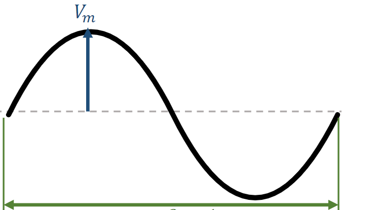
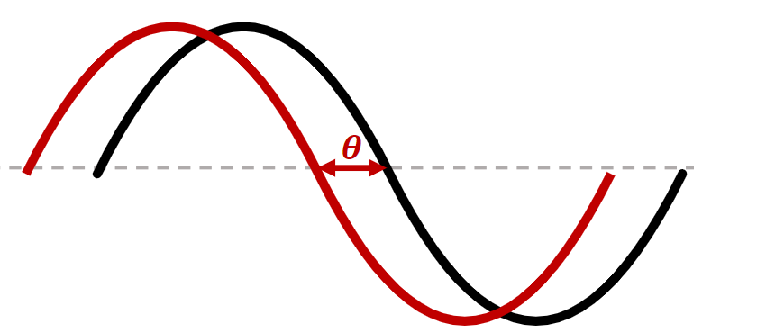

# Lecture 10 - Steady-state sinusoidal analysis (AC)

## Alternating current
Alternating currents
$$
    v(t)=V_msin(\omega t)
$$
$V_m$ = amplitude $[V]$
$\omega$=angular frequenct $[rad/s]$
$f=\frac{1}{T}[Hz]$
$\omega=2\pi f$

$$
    v(t)=V_msin(\omega t) \\
    v(t)=V_msin(\omega t+\theta)
$$

The first (black) wave lags the second (red) wave by $\theta$
The second (red) wave leads the first (black) wave by $\theta$

### RMS or effective values
$$
    V_{root-mean-square}=\sqrt{\frac{1}{T}\int_0^Tv^2(t)dt}
$$
(for sinusoidal case):
$$
    V_{rms}=\frac{V_M}{\sqrt{2}} \qquad I_{rms}=\frac{I_M}{\sqrt{2}} \\
    \implies P_{avg}=\frac{V_{rms}^2}{R} = (I_{rms})^2R
$$

### Converting cosines
$$
    sin(\omega t)=cos(\omega t-90\degree) \\
    cos(\omega t)=sin(\omega t+90\degree)
$$

To compare the phases of two sinusoidal waves:
- Both must be written as either sine or cosine
- Both must be written with positive amplitudes
- Each have the same frequency

## Phasors
$$
    v(t)=V_mcos(\omega t+\theta_m)\implies V=V_m\angle\theta_m
$$
- Phasors are complex numbers that represent sinusoidal voltages or currents as a vector
- The magnitude of a phasor equals the peak value
$V_m=V_m$
- The angle of a phasor equals the phase
$\theta=\theta$

### Polar and rectangular notations
Rect. form:
$$
    z=x+jy \\
    z=|z|(cos\theta+jsin\theta)
$$
Polar form:
$$
    z=|z|\angle\theta\degree \\
    z=|z|e^{j\theta\degree}
$$

Reminder about polar forms:
$$
    e^{i\varphi}=cos\varphi+isin\varphi
$$

### Polar and rectuangular conversions
Polar to rectangular:
$$
    z=r\angle\theta\degree\qquad\qquad z=5\angle 53\degree \\
    x=rcos(\theta\degree)\qquad\qquad x=5(cos(53\degree))=3 \\
    y=rsin(\theta\degree)\qquad\qquad y=5(sin(53\degree))=4 \\
    z=x+jy\qquad\qquad z=3+j4
$$

Rectangular to polar:
$$
    z=x+jy\qquad\qquad z=3+j4 \\
    r=\sqrt{x^2+y^2}\qquad\qquad\sqrt{3^2+4^2}=5 \\
    \theta=tan^{-1}\frac{y}{x}\qquad\qquad\theta=
    tan^{-1}\frac{4}{3}=53\degree \\
    z=r\angle\theta\degree\qquad\qquad z=5\angle 53\degree \\
    z=re^{j\theta\degree}\qquad\qquad 5e^{j53\degree} \\
    z=r(cos\theta+jsin\theta)\qquad\qquad 5(cos(53\degree))
    + jsin(53\degree))
$$

What then:
- Polar
  - Multiplication
  - Division
- Rectangular
  - Addition
  - Subtraction

## Impedance
