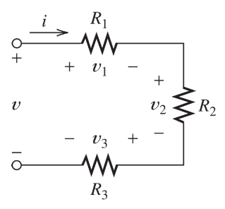
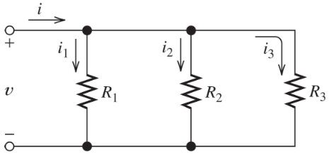
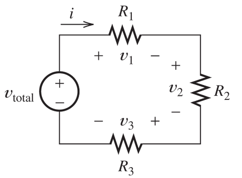

# Lecture 2

## Summary of Lecture 1
Ohm's law:
Voltage = Current * Resistance
    
$V = I * R$

**Kirchkoffs first law:**

>*The current flowing into a node must be equal to the current flowing out from a node*

**Kirchkoffs second law:**

>*The total current in a loop must be equal to zero*

## Power and energy

Power (watts, W) is the rate of energy transferred, or work done, per unit of time

Power = Voltage * Current
$P = V * I$

Conversions

$$
    P (Watt, W) = \frac{V^2}{R} = V * I = R * I^2 \\
    V (Volt, V) = I * R = \frac{P}{I} = \sqrt{P * R}\\
    I (Amps, A) = \sqrt{\frac{P}{R}} = \frac{P}{V} = \frac{V}{R} \\
    R (Ohm, \Omega) = \frac{V}{I} = \frac{P}{I^2} = \frac{V^2}{P}
$$

Energy (watt-hour) is the capacity to do work in a given time.
Power is energy per unit of time

$$
\int_{t_1}^{t_2} p(t) \ dt
$$

1 horsepower = 735.5 watts

## Equivalent resistance

### Series

$$
\begin{equation}
\begin{split} V &= V_1 + V_2 + V_3 \\
    &= i * R_1 + i * R_2 + i * R_3 \\
    &= i * (R_1 + R_2 + R_3)    
\end{split}
\end{equation}
$$

### Parallel

$$
\begin{equation}
\begin{split} i &= i_1 + i_2 + i_3 \\
    &= v/R_1 + v/R_2 + v/R_3 \\
    &= v * (R_1^{-1} + R_2^{-1} + R_3^{-1})
\end{split}
\end{equation}
$$

## DC circuits

### Voltage divider

$$
R_{eq} = R_1 + R_2 + R_3,
i = V_{total} / R_{eq} \\
V_1 = i * R_1 = V_{total} * R_1/(R_1+R_2+R_3) \\
V_2 = i * R_2 = V_{total} * R_2/(R_1+R_2+R_3) \\
V_3 = i * R_3 = V_{total} * R_3/(R_1+R_2+R_3)
$$

### Current divider