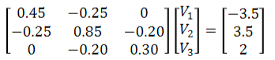
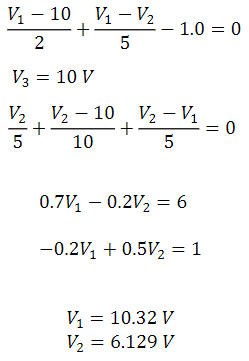

# Lecture 3

Potentiometer

## Node voltage analysis

- Equivalent resistance?
  - No
- Voltage or current dividers?
  - NO
- Answer:
  - Node-voltage analysis!

Steps:
1. Find the nodes
2. Assign a reference node (most connected)
3. Assign node voltages (in a N-npde circuit there will be (n-1) voltages)
4. Do KCL on each node

(KCL = Kirchkoffs current law)

- Consider $i_{out}$ in resistors
- Consider $i_{out}$ as positive
- Consider $V_{current}-V_{adjacent}$

Node-voltage analysis in matrix form
(current out = positive)

$$
V_1/5 + (V_1-V_2)/4 + 3.5 = 0 \\
(V_2-V_1)/4+V_2/2.5+(V_2-V_3)/5 = 0 \\
(V_3-V_2)/5+V_3/10-2=0
$$

$$
0.45*V_1 - 0.25*V_2 = -3.5 \\
-0.25*V_1 + 0.85*V_2 - 0.2V_3 = 3.5 \\
-0.2V_2 + 0.3V_3 = 2
$$

$$
V_1 = -5 V \\
V_2 = 5 V \\
V_3 = 10 V
$$

**NVA with a voltage source**

### Super node

Treat the green area as a single node

$$
(V_1-V_2)/3 + (V_1-V_3)/4-(-3) - (-8) = 0 \\
V_2/1+(V_2-V_1)/3+V_3/5+(V_3-V_1)/4 + (-3) + (-25) = 0 \\
V_3-V_2 = 22V
$$

Nodal analysis is based on Kirchkoff's current law.
$\sum{i_{out}} = \sum{i_{in}}$

Mesh analysis is based on Kirchkoff's voltage law.
$\sum{drops} = 0$

### Mesh-current analysis
- Only for planar circuits
- A circuit is called planar if it's possible to draw it in 2D without having any lines crossing.

Apply KVL to mesh 1 ($\sum{drops}=0$):
$-42+6i_1+3*(i_1-i_2)=0$

Apply KVL to mesh 2 ($\sum{drops}=0$):
$3*(i_2-i_1)+4i_2-10=0$

**Mesh or node?**
- use the one with fewer equations
- use the method you like best
- use both as a check
- use circuit simplifying methods

## Superposition
Only applies to linear circuits (linear elements)
The contribution of each source can be analyzed independently

Method:
1. Leave one source ON and turn all other sources OFF:
   1. Voltage sources: set v=0. These become short circuits
   2. Current sources: set i=0. These become open circuits
   3. Find the response from this source
2. Add the resulting responses to find the total response

## Equivalent circuits

### Norton

### Thevenin