# Lecture 3

Potentiometer

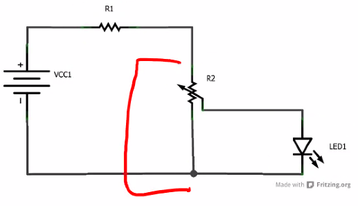

## Node voltage analysis

### Summary
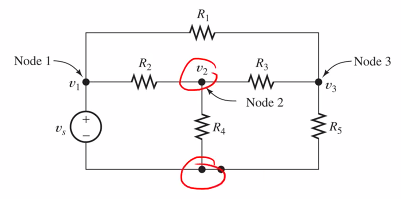
- Equivalent resistance?
  - No
- Voltage or current dividers?
  - NO
- Answer:
  - Node-voltage analysis!

Steps:
1. Find the nodes
2. Assign a reference node (most connected)
3. Assign node voltages (in a N-npde circuit there will be (n-1) voltages)
4. Do KCL on each node

(KCL = Kirchkoffs current law)

- Consider $i_{out}$ in resistors
- Consider $i_{out}$ as positive
- Consider $V_{current}-V_{adjacent}$

### Examples
Node-voltage analysis in matrix form
(current out = positive)
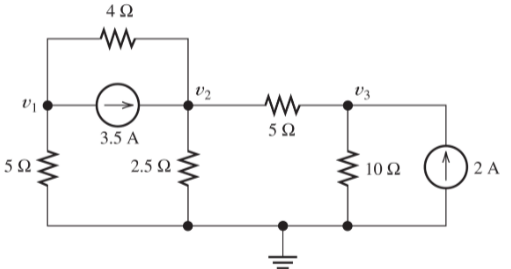

$$
\frac{V_1}{5} + \frac{V_1 - V_2}{4} + 3.5 = 0\\
\frac{V_2 - V_1}{4} + \frac{V_2}{2.5} + \frac{V_2 - V_3}{5} = 0 \\
\frac{V_3 - V_2}{5} + \frac{V_3}{10} - 2 = 0
$$

$$
0.45*V_1 - 0.25*V_2 = -3.5 \\
-0.25*V_1 + 0.85*V_2 - 0.2*V_3 = 3.5 \\
-0.2V_2 + 0.3V_3 = 2
$$

$$
\begin{bmatrix}
  0.45 & -0.25 & 0 \\
  -0.25 & 0.85 & -0.2 \\
  0 & -0.2 & 0.3
\end{bmatrix}
\begin{bmatrix}
  V_1 \\
  V_2 \\
  V_3
\end{bmatrix} = 
\begin{bmatrix}
  -3.5 \\
  3.5 \\
  2
\end{bmatrix}
$$

$$
V_1 = -5 V \\
V_2 = 5 V \\
V_3 = 10 V
$$

**NVA with a voltage source**

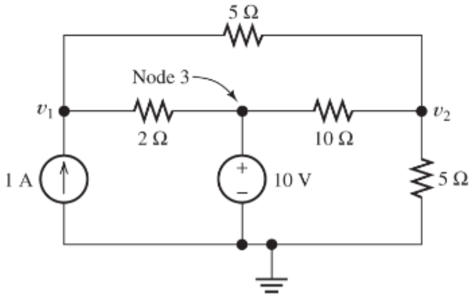

$$
\frac{V_1-10}{2}+\frac{V_1-V_2}{5} - 1.0 = 0 \\
V_3 = 10 V \\
\frac{V_2}{5} + \frac{V_2-10}{10} + \frac{V_2-V_1}{5} = 0 \\
0.7 * V_1 - 0.2 * V_2 = 6 \\
-0.2*V_1 + 0.5*V_2 = 1 \\
V_1 = 10.32V \\
V_2 = 6.129V
$$

**NVA with a dependent source**

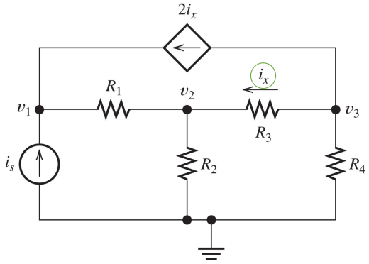

$$
\frac{V_1-V_2}{R_1} - i_s - 2*i_x = 0 \\
\frac{V_2-V_1}{R_1} + \frac{V_2}{R_2} + \frac{V_2-V_3}{R_3} = 0 \\
\frac{V_3-V_2}{R_3} + \frac{V_3}{R_4} + 2*i_x = 0 \\
i_x = \frac{V_3-V_2}{R_3}
$$

### Super node
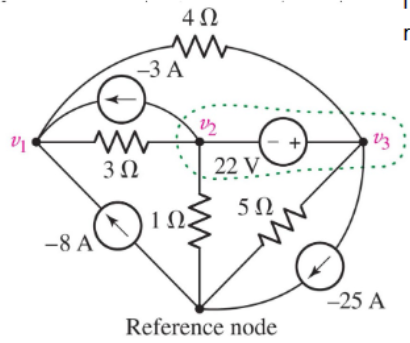
Treat the green area as a single node

$$
\frac{V_1-V_2}{3} + \frac{V_1-V_3}{4} - (-3) - (-8) = 0\\
\frac{V_2}{1} + \frac{V_2-V_1}{3} + \frac{V_3}{5} + \frac{V_3-V_1}{4} + (-25) = 0 \\
V_3 - V_2 = 22V
$$

Nodal analysis is based on Kirchkoff's current law.
$\sum{i_{out}} = \sum{i_{in}}$

Mesh analysis is based on Kirchkoff's voltage law.
$\sum{drops} = 0$

## Mesh-current analysis
- Only for planar circuits
- A circuit is called planar if it's possible to draw it in 2D without having any lines crossing.

### Examples

**Mesh-current**
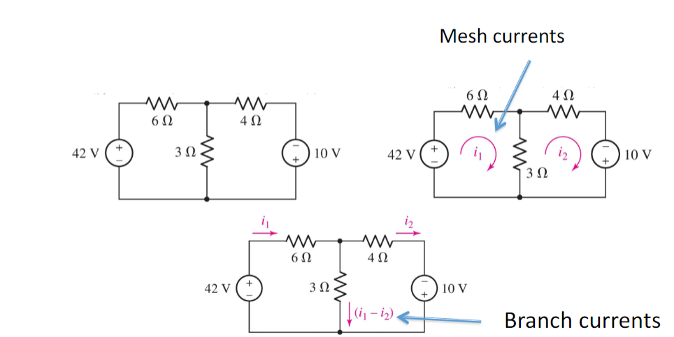

Apply KVL to mesh 1 ($\sum{drops}=0$):
$-42+6i_1+3*(i_1-i_2)=0$

Apply KVL to mesh 2 ($\sum{drops}=0$):
$3*(i_2-i_1)+4i_2-10=0$

**Supermesh**
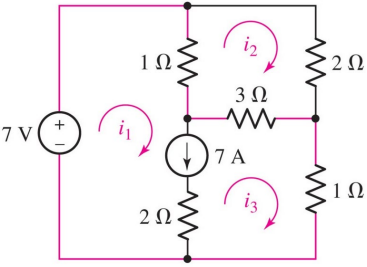

Apply KVL to mesh 2:
$1(i_2-i_1) + 2i_2 + 3(i_2-i_3) = 0$

Apply KVL to supermesh 1/3:
$-7 + 1(i_1-i_2) + 3(i_3-i_2) + 1i_3 = 0$

Add the current source:
$i_1 - i_3 = 7$

**Mesh or node?**
- use the one with fewer equations
- use the method you like best
- use both as a check
- use circuit simplifying methods

## Superposition
Only applies to linear circuits (linear elements)
The contribution of each source can be analyzed independently

Method:
1. Leave one source ON and turn all other sources OFF:
   1. Voltage sources: set v=0. These become short circuits
   2. Current sources: set i=0. These become open circuits
   3. Find the response from this source
2. Add the resulting responses to find the total response

### Examples

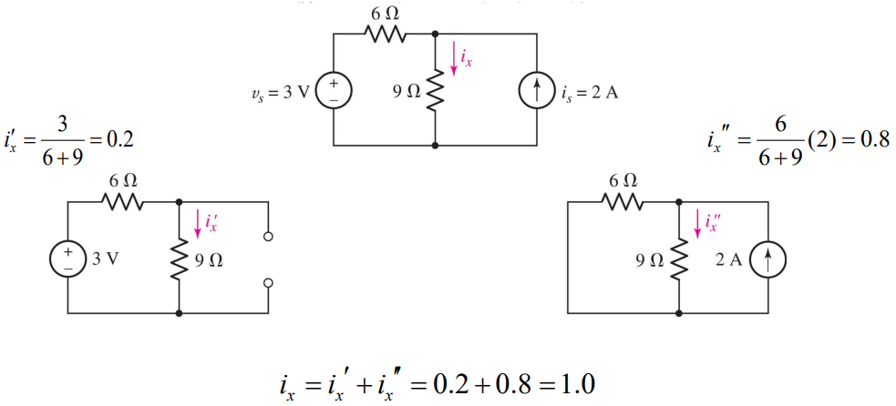
## Equivalent circuits

### Norton
1. Replace the load with a short circuit
2. Find the short circuit current $I_{sc}$
3. Find the equivalent resistance $R_{eq}$ of the network with all independent sources turned off
4. Then
   - $I_N=I_{sc}$
   - $R_N=R_{eq}$

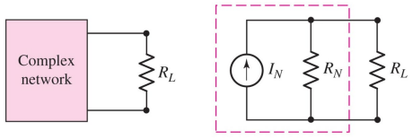

### Thevenin
1. Disconnect the load
2. Find the open circuit voltage $V_{oc}$
3. Find the equivalent resistance $R_{eq}$ of the network with all independent sources turned off.
4. Then
   - $V_{TH}=V_{oc}$
   - $R_{TH}=R_{eq}$

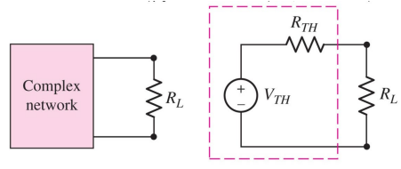

### Source transformation

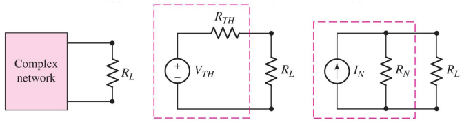

$R_{TH}=R_N=R_{eq}$
$V_{TH}=I_N*R_{eq}$

**Example**
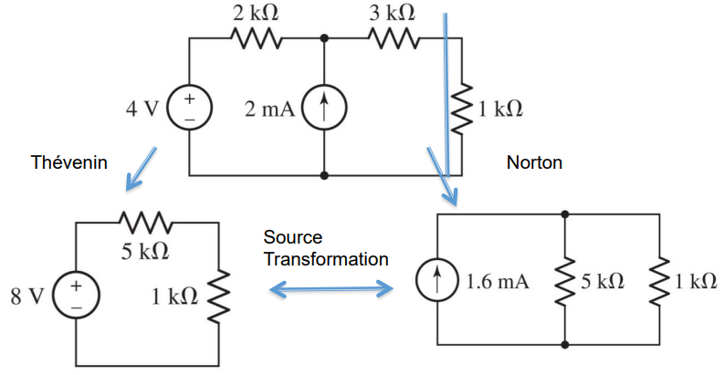