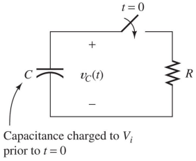
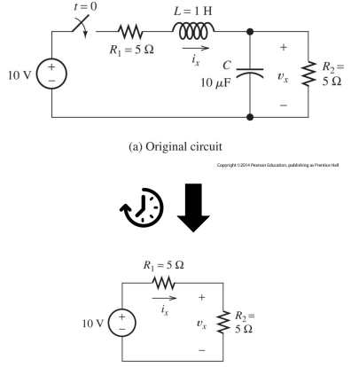

# Lecture 4

Diode: Resistance is $0\ \Omega$ in one direction, $\infty\ \Omega$ in the other

## Capacitors
Stores an electric charge within an electric field
Holds on to their charge for a while after the circuit is offline

`insert electroboom meme here`

### Capacitors

Capacitors has two conducting plates on the outside connecting to the circuit and a Dielectric mass in between.

One plate has negative charge and the other one has positive charge. Electron flow goes from $- \to +$ and current goes from $+ \to -$.

As current flows through a capacitor, charges of opposite signs collect on the respective plates.

When connected to a power source, current will flow "immediately" while voltage will "slowly" increase.

Capacitors vs Battery: A battery is based on a chemical reaction and has regulated voltage. Both store power but stores them differently.

Capacitors have an exponential decrease of voltage over time while batteries have more of an "instant" drop over time.

The ideal capacitor is a **passive** element with circuit symbol

The charge is proportional to the voltage across the plates
$$
    q = Cv
$$

The current-voltage relation is
$$
    i = \frac{dq}{dt} = C\frac{dv}{dt}
$$

The capacitance $C$ is measured in Farads ($F$) - typically $pF$ to $\mu F$

**Example**

v a) $\frac{dv}{dt} = 0, 5V$

v b) $\frac{dv}{dt} = cos(t), Amplitude = 5V$

**Current and charge over time**

**Energy stored in a capacitor**

$$
    i = C\frac{dv}{dt} \\
    p = iv = Cv\frac{dv}{dt} \\
    w(t) = \int_{t_0}^tp(t)dt \\
    w(t) = \int_{t_0}^tCv\frac{dv}{dt}
    = C \int_{v(t_0)}^{v(t)}vdv = \frac{C}{2} ([v(t)]^2-[v(t_0)]^2)
$$

If $v=0$ at $t_0$:
$$
    w(t)=\frac{Cv^2(t)}{2}\ \ \ \ (q=Cv) \\
    w(t)=\frac{v(t)q(t)}{2}\ \ \ \ C=\frac{q}{v} \\
    w(t)=\frac{q^2(t)}{2C}\ \ \ \ v=\frac{q}{C}
$$

Charge in terms of current: $\int_{t_0}^ti(t)\ dt + q(t_0)$

Voltage in terms of current: (slide 17)

**Key capacitor behaviors**
- Capacitors are open circuits to DC voltages (V constant, then i = 0)
- The voltage on a capacitor *cannot* jump (change instantly)
- Capacitors store energy ($I*V > 0$) or deliver energy ($I*V < 0$)

$$
    v(t) = \frac{1}{C}\int_{t_0}^ti(t)\ dt + v(t_0)
$$

**Capacitors in paralell**
*Having three "plates" in parallel is essentially the same as having one large plate (conducting plates)*

$$
    C_{eq} = C_1+C_2+C_3 \\
    i = i_1+i_2+i_3 \\
    i = C\frac{dv}{dt} \\
    i = C_1\frac{dv}{dt} + C_2\frac{dv}{dt} + C_3\frac{dv}{dt} \\
    i = (C_1+C_2+C_3)\frac{dv}{dt}
$$

**Capacitors in series**

$$
    C_{eq}=\frac{1}{\frac{1}{C_1}+\frac{1}{C_2}+\frac{1}{C_3}}
$$

### Inductors
Basically electromagnets

Common geometries:
- Toroidal
- Coil with an iron-oxide slug that can be screwed in or out to adjust the inductance
- Inductor with a laminated iron core

The ideal inductor is a **passive** element with circuit symbol:

The current-voltage relation is $v=L\frac{di}{dt}$

The unit of measurement is Henry ($H$)

Current in terms of voltage in an inductor
$$
    v(t)=L\frac{di}{dt} \\
    di=\frac{1}{L}v(t)\ dt\\
    \int_{i_{t_0}}^{i(t)}di=\frac{1}{L}\int_{t_0}^tv(t)\ dt \\
    i(t)=\frac{1}{L}\int_{t_0}^tv(t)\ dt+i(t_0) \\
$$

Inductors store energy, since $p(t)=i(t)v(t)=i(L\frac{di}{dt})=\frac{dw}{dt}$
then the energy stored in an inductor is $w=\frac{Li^2}{2}$

**Key inductor behaviors**
- Inductors are short circuits to DC voltages ($i$ constant, then $V=0$)
- The current through an inductor *cannot* jump (change instantly)
- Inductors store energy when $IV>0$ or deliver energy when $IV<0$

**Inductors in series**
$$
    L_{eq}=L_1+L_2+ ... + L_n
$$

**Inductors in parallel**
$$
    L_{eq}=\frac{1}{\frac{1}{L_1}+\frac{1}{L_2}+...+\frac{1}{L_n}}
$$

**Two-element shortcuts**
Two capacitors in series: $C_{eq}=\frac{C_1C_2}{C_1+C_2}$

Two inductors in parallel: $L_{eq}=\frac{L_1L_2}{L_1+L_2}$

Two resistors in parallel: $R_{eq}=\frac{R_1R_2}{R_1+R_2}$

## Time-varying currents/voltages

### RC circuits
First-Order RC circuits

$$
    V_c(t)=V_ie^{\frac{-t}{RC}} \\
    \tau=RC \\
    V_c(t)=V_ie^{\frac{-t}{\tau}}
$$

Given $R=5k\ \Omega$ and $C=1\ F$, find the time at which the voltage reaches 1%:
$$
    0.01=e^{\frac{-t_{1\%}}{RC}} \\
    ln(0.01)=-4.605=\frac{-t_{1\%}}{RC} \\
    t=23.03ms
$$

**Time constant $\tau=RC$**
In one time constant $\tau=RC$ the voltage decays by a factor of $e^{-1}\approx0.368$

**Charging a capacitor**
Steady state:
$$
V_C(t)=V_S-V_Se^{\frac{-t}{RC}} \\
V_C(t)=V_S-V_Se^{\frac{-t}{\tau}}
$$

**DC steady state**

Find $V_x$ in the steady state
$i_x=\frac{10}{R_1+R_2}$
$V_x=R_2i_x=5V$

### RL circuits

