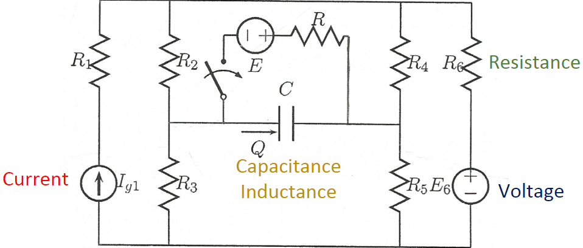
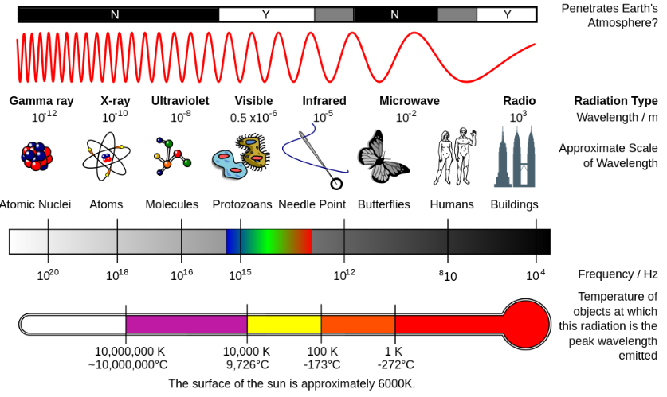
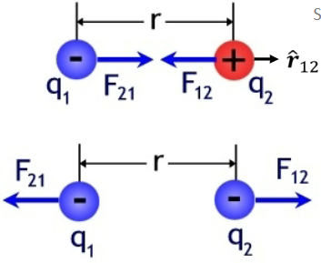
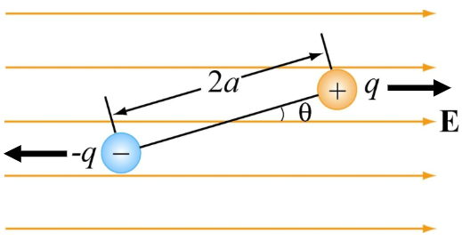
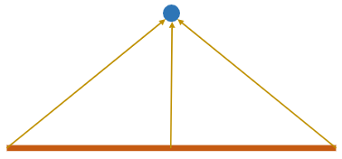
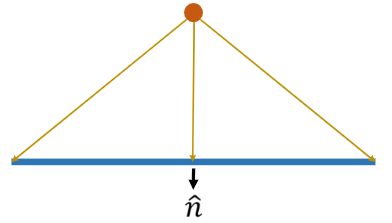
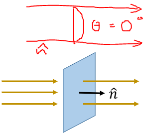
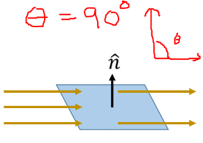
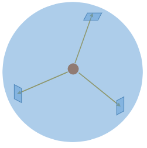
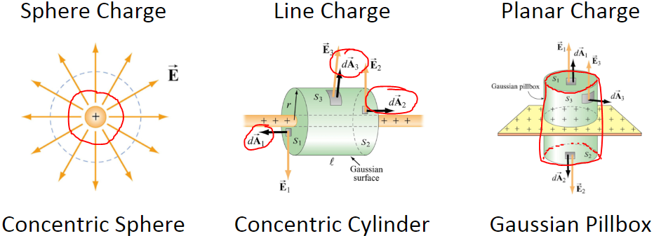

# Lecture 5

Summary of lectures 1-4

## Electric and magnetic fields

Spectrum

Electric waves and magnetic waves flow perpendicular to each other.
If the flow is in the $x$ direction:
- electricity has an amplitude in the $y$ direction
- magnetism has an amplitude in the $z$ direction

### Electric charge

Unit charge (Coulomb): $e^{-}=1.602*10^{-19}\ C$

The total charge within a closed system cannot change. It can only be redistributed.

Electric fields are electrical forces between two charges
- Repulsive if charges are the same
- Attractive if charges are different

This force is proporitonal to the magnitude of and distance between charges

### Coulomb's law

$$\overrightharpoon{F}_{12}=k_e\frac{q_1q_2}{r^2}\hat{r_{12}}$$

Coulomb constant:
$$k_e=\frac{1}{4\pi\varepsilon_0}$$

Electric permittivity (in a vacuum):
$$\varepsilon_0=\frac{10^{-9}}{36\pi}$$

We can rewrite this equation to show the strength of the electric field around a single charge.
$$\overrightharpoon{E}=k_e\frac{q}{r^2}\hat{r}$$

Given an electric field, we can calculate the force on a point charge:
$$\overrightharpoon{F}_E=q\overrightharpoon{E}$$

Similarities to gravity:
$$
\overrightharpoon{F}_{12}=k_e\frac{q_1q_2}{r^2}\hat{r}_{12}\quad\quad\overrightharpoon{F}_g=-G\frac{Mm}{r^2}\hat{r}\\
\overrightharpoon{F}_E=q\overrightharpoon{E}\quad\quad\overrightharpoon{F}_g=m\overrightharpoon{g}
$$

### Electric field lines

Fieldlines are a graphical representation of the vector field of electric forces

The direction of the force at any given coordinate is tangent to the field line at that point.

### Superposition

The net electric force acting on one charge is the vector sum of all forces from other charges.
Thus, the net electric field is the vector sum of all electric fields:
$$
\overrightharpoon{F}_j=\displaystyle\sum_{i=1}^N\overrightharpoon{F}_{ij} \quad\quad
\overrightharpoon{E}=\displaystyle\sum_{i=1}^N\overrightharpoon{E}_i
$$

## Dipoles

Two equal and opposite charges are known as a dipole.
A dipole moment is a measure of the density of the electric field of a dipole.
$$\overrightharpoon{P}=q\overrightharpoon{d}$$

Placing a dipole in an electric field applies a torque on the dipole
$$
\overrightharpoon{\tau}=\overrightharpoon{p}\times\overrightharpoon{E} \\
\tau=p\cdot E \sin(\theta)
$$
(Torque wants to aling $\overrightharpoon{p}$ with $\overrightharpoon{E}$)

## Electric flux

Instead of discrete points, let's say we had a continuous distribution of charges on a line.
We would calculate the net field of the point as an integral of the charge distribution along the length of the line.

$$
    \overrightharpoon{E}=\displaystyle\sum_{i=1}^N\overrightharpoon{E}_i =
    \int_{L1}^{L2}\overrightharpoon{E}_l\ dl
$$

Now, let's flip it around. We have a point charge and want to calculate the total electric field through a line. This is called electric flux.

$$
    \Phi=\displaystyle\sum_{i=1}^N\overrightharpoon{E}_i =
    \int_{L1}^{L2}\overrightharpoon{E}_l\ dl
$$

Now we add another dimension and calculate the flux through a given area.

$$
    \Phi=\iint\overrightharpoon{E}\cdot\hat{n}\cdot d\overrightharpoon{A} = 
    \iint\overrightharpoon{E}\cdot d\overrightharpoon{A}\ cos(\theta)
$$

Another example: (when $\theta=0\degree$, the total flux is also $0$)

$$
    \Phi=\iint\overrightharpoon{E}\cdot\hat{n}\cdot d\overrightharpoon{A} = 
    \iint\overrightharpoon{E}\cdot d\overrightharpoon{A}\ cos(\theta)
$$

**Electric flux within a closed contour**

Within a closed contour, we use a special integral symbol:
$$
    \Phi=\oiint\overrightharpoon{E}\cdot d\overrightharpoon{A}
$$

What is the total flux through this surface?
$$
    d\overrightharpoon{A}=4\pi r^2 \quad\quad \overrightharpoon{E}=\frac{q}{4\pi r^2\varepsilon_0}\hat{r} \\
    \Phi = \frac{q}{4\pi r^2\varepsilon_0}4\pi r^2=\frac{q}{\varepsilon_0}
$$

Regardless of how we defined our closed space/contour, the flux will remain the same.

### Gauss' law
The total charge contained within a closed surface divided by $\varepsilon_0$ is equal to the surface integral of the electric field over the entire surface.
$$
    \Phi_E=\oiint\overrightharpoon{E}\cdot d\overrightharpoon{A}=\frac{Q}{\varepsilon_0}
$$
Given knowledge of the electric field, you can easily calculate the charge distribution.
Given knowledge of the electric charge distribution, you can more difficultly calculate the electric field.

($\oiint$ is the 3 dimensional closed contour integral)

### Gaussian surfaces
To calculate electric field from a point, we enclose that point in a sphere.
What if we want to calculate the electric field from a wire or a flat surface? To answer this we need to look for symmetries.

In a line charge, the total net field through $S_1$ and $S_3$ is $0$.