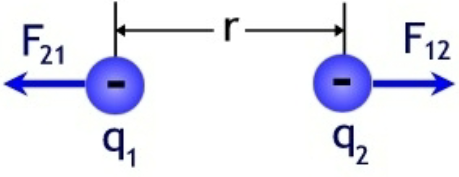
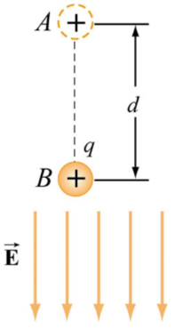
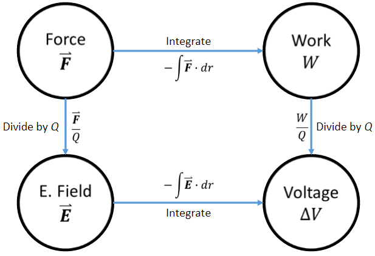
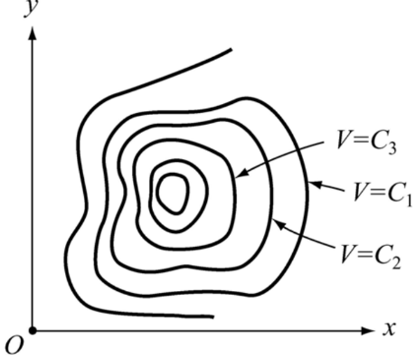

# Lecture 6

## Work
To move charges apart from one another, they must do work.

$$
    W=F\overrightharpoon{r} \\
    \overrightharpoon{F}_{12}=k_e\frac{q_1q_2}{r^2}\hat{r}_{12} \\
    W=\int_R^{\infty}\overrightharpoon{F}\cdot d\overrightharpoon{r} = -k_eq_1q_2
    \int_R^{\infty}\frac{d\overrightharpoon{r}}{r^2}=\frac{k_eq_1q_2}{R}
$$

### Work in an electric field
Now consider a charge moving in the direction of a uniform electric field.

$$
    W=\overrightharpoon{F}\cdot d\overrightharpoon{r} \\
    \overrightharpoon{F}_E=q\overrightharpoon{E} \\
    W=-\int_A^B\overrightharpoon{F}\cdot d\overrightharpoon{r}=-\int_A^Bq\overrightharpoon{E}
    \cdot d\overrightharpoon{r}=-qE_0\int_A^Bd\overrightharpoon{r}=-qE_0d
$$

If moving perpendicular to a uniform electric field, what is the work?
Answer: 0, cause $\int_A^Bd\overrightharpoon{r}=0$

### Potential Energy
Another way to write work is as the difference in potential energy.
$$
W=\Delta U=-\int_A^B\overrightharpoon{F}\cdot d\overrightharpoon{r}
$$

This potential is proportional ot the charge $\overrightharpoon{F}_E=q\overrightharpoon{E}$

### Electric potential
Normalizing this by the charge gives us:
$$
    \frac{W}{q}=-\int_A^B\overrightharpoon{E}\cdot d\overrightharpoon{r}=\Delta V
$$

Recall the definition of voltage from L1: $[\Delta V]=\frac{J}{C}$

### Voltage
What happens if we calculate the work across a closed path?
$$
    -\oint\overrightharpoon{F}\cdot d\overrightharpoon{r}=0
$$

## Electric field and voltage

### Equipotential curves
We can work backwards from a known voltage to calculate the electric field.

$$
    \Delta V = -\int_A^B\overrightharpoon{E}\cdot d\overrightharpoon{r} \\
    dV=-\overrightharpoon{E}\cdot d\overrightharpoon{r} \\
    \overrightharpoon{E}=-\frac{dV}{d\overrightharpoon{r}}=-\nabla V
$$

Equipotential curves show regions of constant potential.
The electric field $\overrightharpoon{E}$ is perpendicular (normal) to these curves.

## Capacitance

### Capacitors

### Stored energy